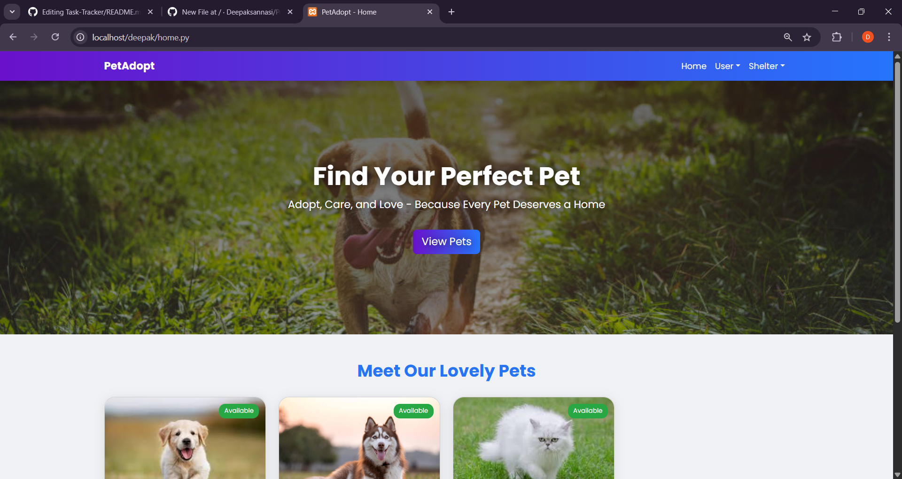
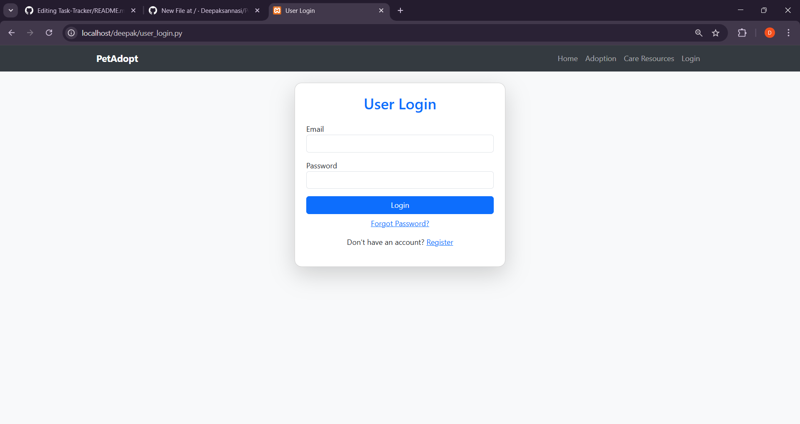
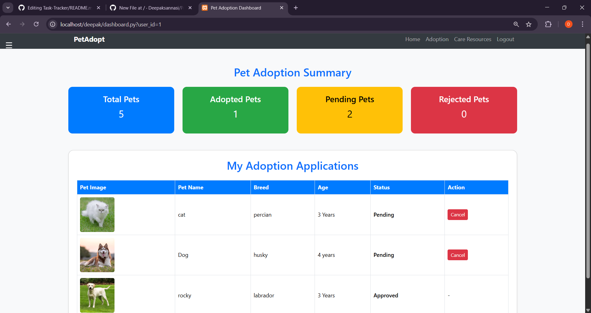
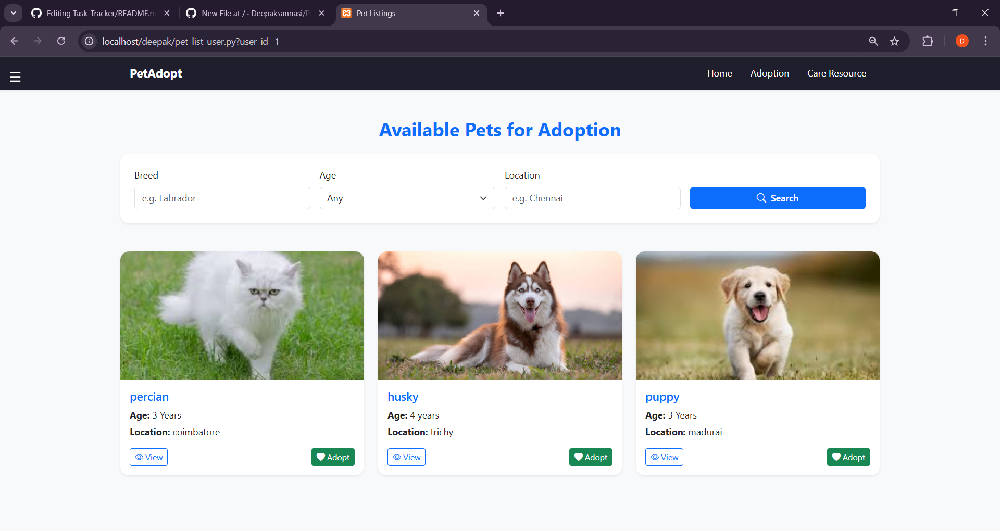
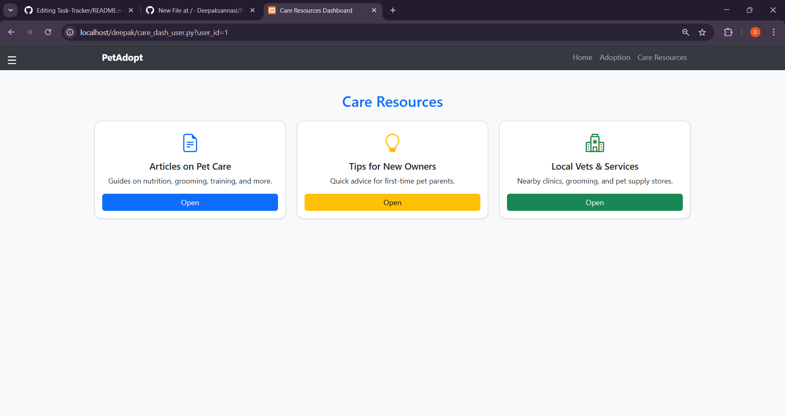
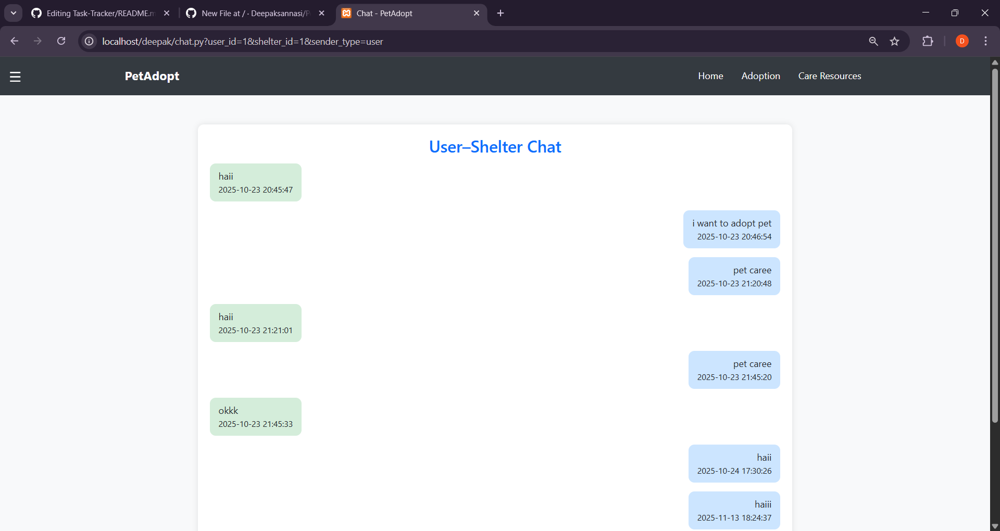
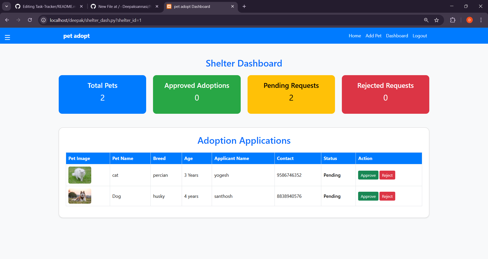
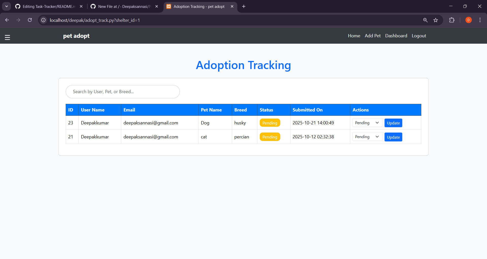
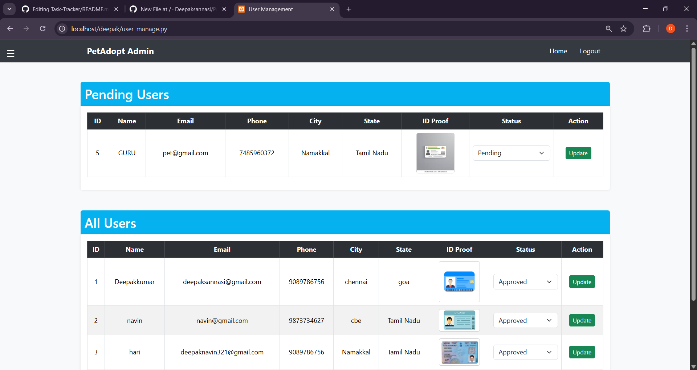
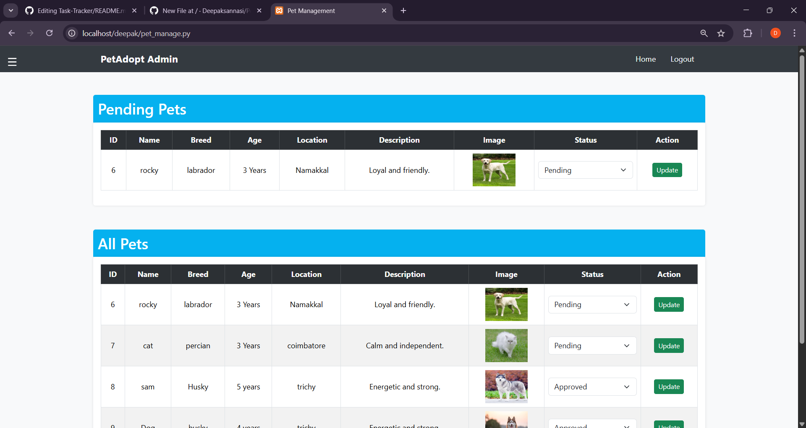

# 🐾 Pet Adoption System

A full-stack pet adoption web application built with Python CGI, MySQL, and modern web technologies. This system connects shelters and users, making pet adoption simple, transparent, and secure.

## 🌟 Features

- 🐶 Browse pets available for adoption
- ✅ Admin/Shelter approval system for pets
- 🚫 Prevents duplicate adoption of the same pet
- 📝 User registration & login
- 🏠 Shelter registration & login
- 📄 Pet listing with images, age, breed, and location
- 📌 Adoption request & approval workflow
- 🎨 Modern, responsive UI using Bootstrap 5
- 📱 Mobile-friendly design
- 🔒 Role-based access (User / Shelter / Admin logic)

## 🚀 Tech Stack

### Backend
- **Python 3.11** - Core programming language
- **CGI** - Common Gateway Interface for web server communication
- **PyMySQL** - MySQL database connector

### Frontend
- **HTML5** - Markup language
- **CSS3** - Styling with modern features
- **JavaScript (ES6+)** - Client-side interactivity
- **Bootstrap 5** - Responsive UI framework
- **Bootstrap Icons** - Icon library

### Database
- **MySQL 8.0** - Relational database management system

### Server
- **Apache HTTP Server** - Web server with CGI support

## 📸 Screenshots

### Home Page



### User Login Page


### User Dashboard Page


### Pet Listings Page


### Care Resources Page


### User-Shelter Communicate Page


### Shelter Dashboard Page


### Adoption Tracking Page


### Admin Approve Users Page


### Admin Approve Pets Page


## 🛠️ Setup Instructions

### Prerequisites
```bash
# Required Software
Python 3.11 or higher
MySQL 8.0 or higher
Apache HTTP Server (XAMPP recommended)
Git
Web Browser (Chrome/Edge/Firefox)
```
### Step 1: Clone the Repository
```bash
git clone https://github.com/yourusername/pet-adoption-system.git
cd pet-adoption-system
```

### Step 2: Database Setup
```bash
Open MySQL Command Line or phpMyAdmin
Create database
CREATE DATABASE pet;

Use the database
USE pet;

Import the SQL file (from phpMyAdmin or command line)
For command line:
SOURCE /path/to/pet-adoption-system/database/pet.sql;

Or in phpMyAdmin:
1. Select the 'pet' database
2. Click 'Import' tab
3. Choose pet.sql file
4. Click 'Go'
```

### Step 3: Configure Database Connection
```bash
# File: home.py (and other .py files)
import pymysql

# Update these credentials as per your MySQL setup
con = pymysql.connect(
    host="localhost",      # MySQL host
    user="root",           # MySQL username
    password="",           # MySQL password
    database="pet"         # Database name
)
```

### Step 4: Enable CGI in Apache (XAMPP)
```bash # 1. Open C:\xampp\apache\conf\httpd.conf
# 2. Uncomment or add this line:
LoadModule cgi_module modules/mod_cgi.so

# 3. Add CGI directory configuration (add this at the end):
<Directory "C:/xampp/htdocs/pet-adoption-system">
    Options +ExecCGI
    AddHandler cgi-script .py
    AllowOverride All
    Require all granted
</Directory>

# 4. Restart Apache from XAMPP Control Panel
```
### Step 5: Configure Python for CGI
```bash
# Add this to the top of all Python files (.py):
#!/Python311/python
# Or the path to your Python executable

import cgi
import cgitb
cgitb.enable()  # For error debugging

print("Content-Type: text/html\n")
```

### Step 6: Run the Project
```bash
# 1. Copy the project folder to XAMPP htdocs:
C:\xampp\htdocs\pet-adoption-system\

# 2. Start Apache and MySQL from XAMPP Control Panel

# 3. Open browser and navigate to:
http://localhost/pet-adoption-system/home.py
```
## 🔐 Default Login Credentials

Use the following credentials to log in to the application:

### 🐶 User Account
**Username:** navin@gmail.com  
**Password:** 123456

### 🏠 Shelter Account
**Username:** navin@gmail.com  
**Password:** 123456

### 👑 Admin Account
**Username:** admin  
**Password:** admin123

> ⚠️ *These credentials are for testing/demo purposes only.  
